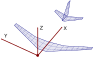

.. _coordinate_systems:

Coordinate systems
==================

In |name| there are two different coordinate systems, a *body-fixed* system and an *aerodynamic* system.

Body-fixed coordinate system
----------------------------

The body-fixed coordinate system can also be seen as a *global* system. The aircraft geometry, the centre of gravity and centre of rotation are defined in this system. Data in the aircraft input file is assumed to be defined in this system (see **TODO**). The longitudinal aircraft axis is expected to be parallel to :math:`X`. The starboard wing span points in the :math:`Y` direction and :math:`Z` points upwards (right-handed coordinate system).

   Body fixed coordinate system

.. note::

    CPACS_ uses the same convention. See also:

    * https://www.cpacs.de/pages/documentation.html

Aerodynamic coordinate system
-----------------------------

The aerodynamic coordinate system is only relevant for the lift, drag and side force and the respective coefficients. The *freestream direction* expressed in the *global* (body-fixed) system is given as

.. math::

    \mathbf{V}_\infty =
    \begin{pmatrix}
    V_x \\
    V_y \\
    V_z
    \end{pmatrix}_\infty
    =
    V_\infty \cdot
    \begin{pmatrix}
    \cos \alpha \cdot \cos \beta \\
    -\sin \beta \\
    \sin \alpha \cdot \cos \beta
    \end{pmatrix}

.. figure:: ../_static/images/conventions/aerodynamic_angles.svg
   :width: 300 px
   :align: center
   :alt: Aerodynamic angles

   Angle of attack :math:`\alpha` and sideslip angle :math:`\beta`. Here :math:`\alpha` is negative and :math:`\beta` is positive.

where :math:`\alpha` is the angle of attack and :math:`\beta` is the sideslip angle. The transformation of the global forces :math:`F_x`, :math:`F_y` and :math:`F_z` into the aerodynamic system is given as

.. math::

    \begin{pmatrix}
    F_D \\
    F_C \\
    F_L
    \end{pmatrix}
    =
    \begin{bmatrix}
    \cos \beta \cdot \cos \alpha & -\sin \beta & \cos \beta \cdot \sin \alpha \\
    \sin \beta \cdot \cos \alpha & \cos \beta & \sin \beta \cdot \sin \alpha \\
    -\sin \alpha & 0 & \cos \alpha
    \end{bmatrix}
    \cdot
    \begin{pmatrix}
    F_x \\
    F_y \\
    F_z
    \end{pmatrix}

where :math:`F_D`, :math:`F_C` and :math:`F_L` are drag, side force and lift, respectively.

.. seealso::

    * [Drela2014]_

..
    **TODO**
    -- Centre of gravity
    -- Centre of rotation
