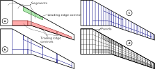

Meshing
=======

.. note::

    This summary is based on/copied from [Dett19]_ with the authors permission.

.. figure:: ../_static/images/conventions/aircraft_hierarchy.svg
    :width: 550
    :alt: Aircraft model
    :align: center

A wing may have any number of leading and trailing edge control surfaces. In order generate a suitable VLM mesh, a systematic approach is required. :numref:`meshing` illustrates the general meshing algorithm. The planform geometry of an example wing is shown :numref:`meshing` (a). It has three segments as well as one leading edge device and three trailing edge devices. In a first meshing step, spanwise subdivisions are added at each segment or control surface border (:numref:`meshing` (b)). This ensures that control surface geometries are correctly captured. More spanwise division are added to produce a finer spanwise discretisation (:numref:`meshing` (c)). Finally, chordwise subdivisions are added, such that each resulting quadrilateral is a panel used in the VLM analysis (:numref:`meshing` (d)).

.. _meshing:

   Meshing algorithm
