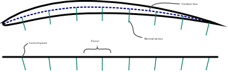

Flow tangency condition
=======================

.. note::

    This summary is based on/copied from [Dett19]_ with the authors permission.

**TODO** This sections needs to be improved!

The effect of cambered aerofoils and control surface deflections can be modelled using the same general concept of rotating panel normal vectors. The rotated normals (located at the panel control points, see :ref:`sec_theory`) change the flow tangency boundary condition, and thus alter the flow field accordingly.

.. _normal_rotations_controls:
.. figure:: _static/images/normal_rotations_controls.svg
   :width: 400 px
   :alt: Control surface modelling
   :align: center

   Control surface modelling

The VLM cannot reflect the real aerofoil geometry which has some thickness with an upper and lower surface. However, the aerofoil camber can be taken into account by tilting panel normals according to the local normal of the camber line. This idea is illustrated in :numref:`normal_rotations_controls` Control surface deflections, effectively changing the wing camber, are modelled analogous to cambered aerofoils. All panel normal vectors belonging to a control surface are rotated about a defined hinge axis (:numref:`normal_rotations_airfoils`).

.. _normal_rotations_airfoils:

   Airfoil modelling

The normal rotations may be computed using the Euler-Rodrigues formula, or based on a small-angle approach as shown by [Drela2014]_. In particular, when modelling deformed wings care must be taken to chose correct rotation axes. Melin's Tornado also implements another approach to model control surface deflections which involves rotations of entire panels and modifications to the horseshoe vortex geometry [Melin2000]_.
