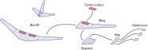
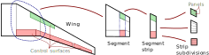
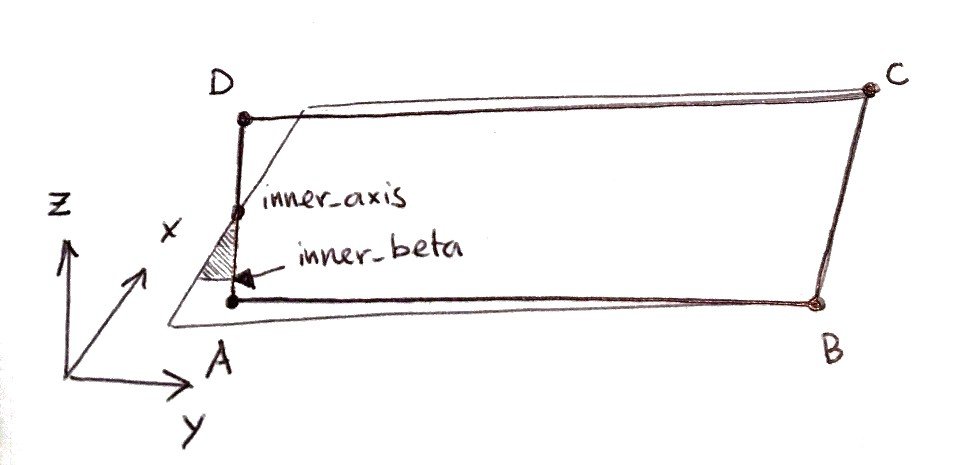
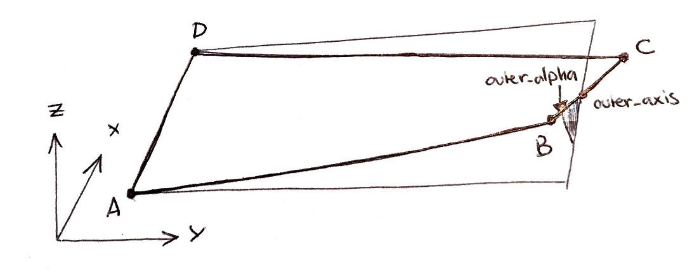
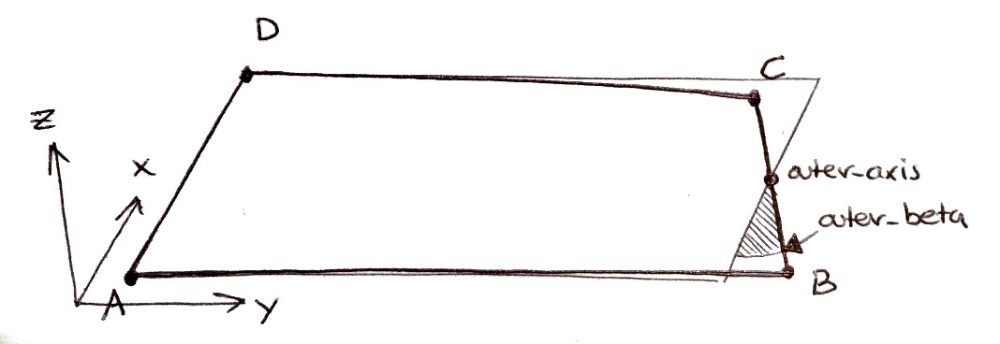
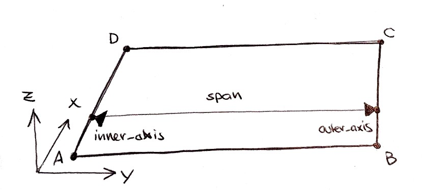
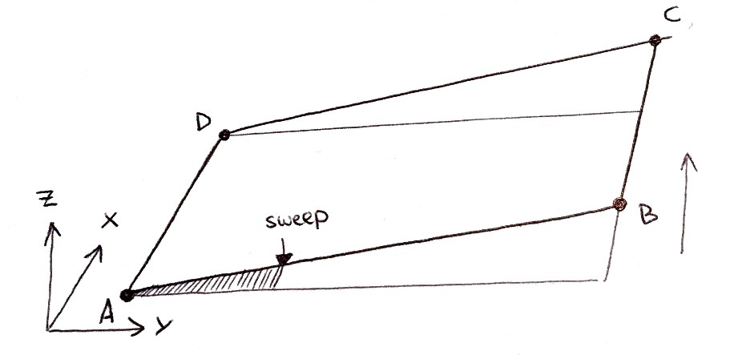
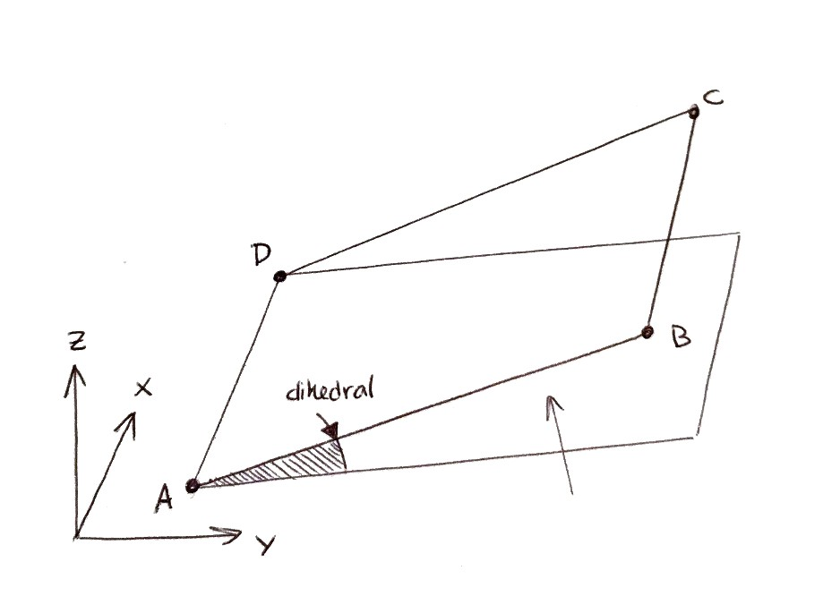
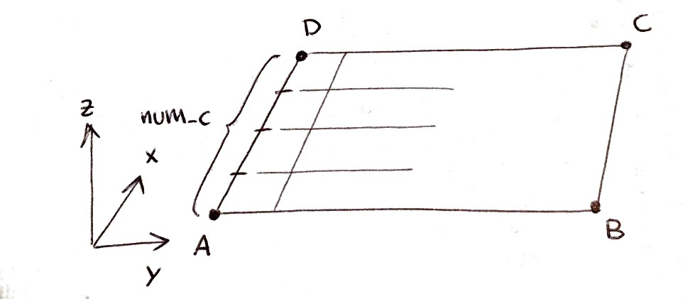

Conventions
===========

This page summarises conventions used in the program.

Object hierarchy
----------------

All data related to the aircraft model is contained in the ``Aircraft`` class. Much like in the CPACS_ definition, the aircraft is represented as an assembly of components structured hierarchically:

    * The ``Aircraft`` has lifting surfaces which are instances of class ``Wing``
    * Each ``Wing`` is defined as the assembly of twisted quadrilaterals ``WingSegment``
    * Each ``WingSegment`` is further divided into ``SegmentStrip``
    * Each ``SegmentStrip`` is further divided into ``StripSubdivision``
    * Each ``Wing`` can have control surfaces ``WingControl``

   Basic object hierarchy. An aircraft object is made up of wings, segments, controls, strips and strip subdivisions.

.. note::

    The user of |name| will only ever have to deal with the defintion of the aircraft, wings and control surfaces. **TODO** and **TODO** are internal objects used to facilitate mesh generation for aircraft with control surfaces.

For the meshing of the wing, it is important to keep track of what parts of the wing is "static" and what parts are "movable" (control surfaces). This book keeping is done using ``Subdivisions`` and ``Subareas``. The smallest unit (subareas) are small quadrilateral segments of the wing. They "know" where they are located, and to what segment and to what control device they belong.

.. figure:: _static/images/2019-02-03_PyTornado_Hierarchy_cropped.jpg
   :width: 800 px
   :alt: Internal hierarchy
   :align: center

   |name|'s internal hierarchy

.. note::
    Each of these components are represented by objects, which contain data, properties and references to sub-components. Each component is identified and accessed by a unique string, or name. Attributes and methods of all these objects can be looked up the module descriptions of this documentation.

Segment geometry
----------------

vertices.a, vertices.b, vertices.c and vertices.d are the four corner points of each segment. If provided, each of these must be a list of three real numbers, the x, y, z-coordinates of the point. If not, they should be set to NONE, or they may simply be omitted.

.. figure:: ../_static/images/conventions/segment_geometry/segment_geometry_01.png
   :scale: 50
   :alt: Ordering
   :align: center

   Ordering

geometry.inner_chord is the chord of the segment edge AD. geometry.inner_chord must be a real number. If geometry.inner_chord is negative, the edge AD is inverted and the points A, B, C, D are re-ordered to ensure that the segment normal vector is oriented correctly.

.. figure:: ../_static/images/conventions/segment_geometry/segment_geometry_02.png
   :scale: 50
   :alt: Segment inner chord
   :align: center

   Segment inner chord

geometry.inner_alpha is the angle of incidence of the segment edge AD. geometry.inner_alpha must be a real number between -90.0 and +90.0 (degrees).

.. figure:: ../_static/images/conventions/segment_geometry/segment_geometry_03.png
   :scale: 50
   :alt: Segment inner alpha
   :align: center

   Segment inner alpha

geometry.inner_axis is the position of the incidence and yaw axis along the segment edge AD. geometry.inner_axis must be a real number between 0.0 and 1.0 (chord fraction). By default, the axis lies along the quarter-chord line, at 0.25.

   Segment inner axis

geometry.outer_chord is the chord of the segment edge BC. geometry.outer_chord must be a real number. If geometry.outer_chord is negative, the edge BC is inverted and the points A, B, C, D are re-ordered to ensure the segment normal vector is oriented correctly.

.. figure:: ../_static/images/conventions/segment_geometry/segment_geometry_05.png
   :scale: 50
   :alt: Geometry outer chord
   :align: center

   Geometry outer chord

geometry.outer_alpha is the angle of incidence of the segment edge BC. geometry.outer_alpha must be a real number between -90.0 and +90.0 (degrees).

   Segment outer alpha

geometry.outer_beta is the angle of yaw of the segment edge BC. geometry.outer_beta must be a real number between -90.0 and +90.0 (degrees).

   Segment outer beta

geometry.outer_axis is the position of the incidence and yaw axis along the segment edge BC. geometry.outer_axis must be a real number between 0.0 and 1.0 (chord fraction). By default, the axis lies along the quarter-chord line, at 0.25.

geometry.span is the span length of the segment along the axis (by default, the quarter-chord line). geometry.span must be a real number. If geometry.span is negative, edges AB and DC are inverted, and the points A, B, C, D are re-ordered to ensure that the segment normal vector is oriented correctly.

   Segment outer axis and span

geometry.sweep is the angle sweep measured at the leading edge AD. geometry.sweep must be a real number, strictly between -90.0 and +90.0 (degrees).

   Segment sweep

geometry.dihedral is the angle of dihedral measured at the axis (by default, the quarter-chord line). geometry.dihedral must be a real number between -90.0 and +90.0 (degrees).

   Segment dihedral

At least one of vertices.a, vertices.b, vertices.c or vertices.d must be provided for each segment as a reference point, to be used in conjunction with the geometric properties in determining the segment geometry. The user must provide either:

    * all of geometry.*, with one of vertices.a, vertices.b, vertices.c or vertices.d. (one reference point and all geometric parameters)
    * all of geometry.* except geometry.inner_*, with vertices.a and vertices.d. (edge AD and the remaining geometric parameters)
    * all of geometry.* except geometry.outer_*, with vertices.b and vertices.c. (edge BC and the remaining geometric parameters)
    * none of geometry.* and all of vertices.a, vertices.b, vertices.c and vertices.d. (all points ABCD)

Airfoils
~~~~~~~~

airfoils.inner is the name of the wing profile at the segment edge AD. airfoils.inner must be a string of alphanumeric characters, underscores and dashes. The corresponding file blade.* must exist within the airfoils folder of the project directory.

.. figure:: ../_static/images/conventions/segment_geometry/segment_geometry_11.png
   :scale: 50
   :alt: Segment inner airfoil
   :align: center

   Segment inner airfoil

airfoils.outer is the name of the wing profile at the segment edge BC. airfoils.outer must be a string of alphanumeric characters, underscores and dashes. The corresponding file blade.* must exist within the airfoils folder of the project directory.

.. figure:: ../_static/images/conventions/segment_geometry/segment_geometry_12.png
   :scale: 50
   :alt: Segment outer airfoil
   :align: center

   Segment outer airfoil

panels.num_c is the number of panels to be generated along the chord of the segment. If provided, panels.num_c must be a positive integer. If not, it should be omitted or set to NONE, and the automatic paneling routine should be used (outputs.autopanels in the settings file).

   Segment num_s panels

panels.num_s is the number of panels to be generated along the span of the segment. If provided, panels.num_s must be a positive integer. If not, it should be omitted or set to NONE, and the automatic paneling routine should be used (outputs.autopanels in the settings file).

.. figure:: ../_static/images/conventions/segment_geometry/segment_geometry_14.png
   :scale: 50
   :alt: Segment num_c panels
   :align: center

   Segment num_c panels
