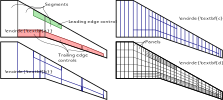
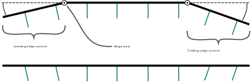
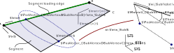
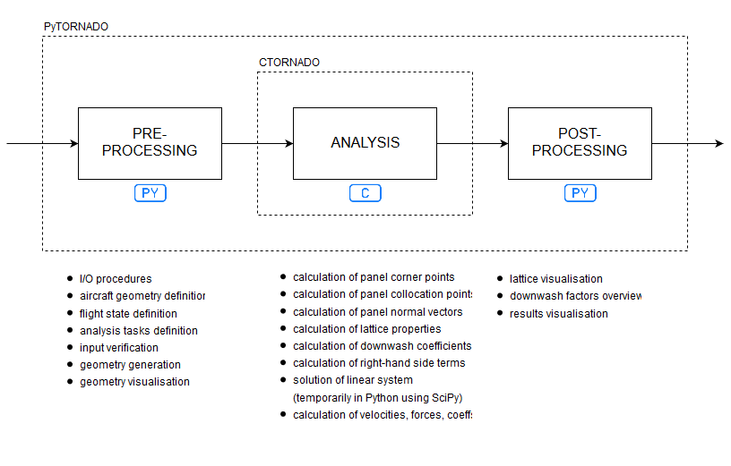
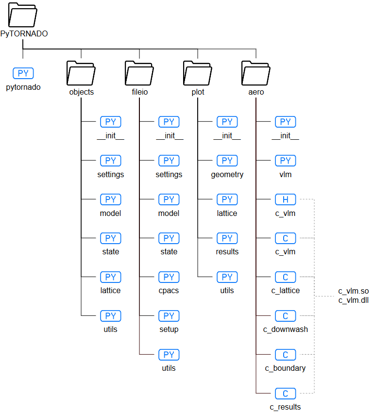

Program structure
=================

   Meshing algorithm

Aerofoil and control surface modelling by modification of the flow tangency boundary condition using normal rotations

.. image:: _static/images/normal_rotations_airfoils.svg
   :width: 300 px
   :alt: Airfoil modelling
   :align: center

.. image:: _static/images/normal_rotations_airfoils.svg
   :width: 300 px
   :alt: Airfoil modelling
   :align: center

**TO BE UPDATED...**

Programming language
--------------------

|name| is written in *Python 3* and *C/C++*.

* Computationally intensive routines such as the generation of the aircraft lattice, and the calculation of aerodynamic forces and coefficients, are implemented in C/C++ to ensure performance of the program for large calculations.

* Python constitutes the bulk of the remaining code, dedicated to pre- and post-processing operations. This includes input and output to file, verification of the user inputs, generation of the geometry and visualisation. The explicit, object-oriented syntax makes the code dedicated to these tasks significantly more readable, simplifying future maintenance and extension of |name|.

* The interaction between Python and C/C++ is coded using the native APIs for Python and NumPy. The relevant data provided to, and produced by, the analysis routines is pre-allocated in Python. C/C++ operates directly on this data.

    * https://docs.python.org/3/c-api/index.html
    * https://docs.scipy.org/doc/numpy-1.12.0/reference/c-api.html

   Outline of the program execution

More notes on the C API:

.. toctree::
   :maxdepth: 1

   c_api

Program file structure
----------------------

The program is partitioned into files (*modules*) and folders (*packages*). Intimately related functions exist within the same module, and closely inter-dependent modules are grouped within the same package.

The resulting hierarchy of the program files is shown in the figure below, and commented in further detail below.

   Outline of the |name| source file structure

.. warning::
    Picture not up to date!

Main script
~~~~~~~~~~~

The module pytornado is executed as a script whenever the program is called from terminal. Input arguments are parsed, data structures are initialized, and program tasks are managed at the highest level by calls to various lower-level packages.

Data structures
---------------

Aircraft
~~~~~~~~

The Aircraft data structure contains the entire aircraft model. An aircraft model is identified by its attribute name, accessed by using aircraft.name.

A number of reference values must be provided as properties of the aircraft model. These are stored in a dictionary, the Aircraft.refs attribute:

    * ``area`` reference surface area
    * ``span`` reference (semi-)span
    * ``chord`` reference chord
    * ``gcenter`` center of gravity (x, y, z-coordinates)
    * ``rcenter`` reference rotation point (x, y, z-coordinates)

Wing
~~~~

Each Wing object contains data, properties and components of a given lifting surface. Each wing is identified by its index in Aircraft.wing.

Symmetry
________

The Wing.symmetry attribute defines symmetry for the entire lifting surface. Accepted values are:

    * 0	no symmetry
    * 1	symmetry across y, z-plane
    * 2	symmetry across x, z-plane
    * 3	symmetry across x, y-plane

Wing controls
~~~~~~~~~~~~~

The WingControl sub-components of Wing are stored in its Wing.control attribute. Each WingControl must have a unique identifier, which is used to access it in Wing.control.

Wing segment
~~~~~~~~~~~~

Each WingSegment object contains data and properties of a quadrilateral segment of lifting surface. Each segment is identified by its index in Wing.segment.

Vertices
________

The x, y, z-coordinates of each of the four corner points A, B, C, D of the quadrilateral segment are stored in the dictionary WingSegment.vertices.

The vertices are re-ordered so that the orientation of the segment’s normal vector is consistent.

Geometric properties
^^^^^^^^^^^^^^^^^^^^

The geometric properties of each segment are stored in the dictionary WingSegment.geometry. These are listed and described below:

    * ``inner_chord`` chord of segment edge AD
    * ``inner_alpha`` incidence angle of segment edge AD
    * ``inner_beta`` yaw angle of segment edge AD
    * ``inner_axis`` position of twist axis on segment edge AD as fraction of inner_chord
    * ``outer_chord`` chord of segment edge BC
    * ``outer_alpha`` incidence angle of segment edge BC
    * ``outer_beta`` yaw angle of segment edge BC
    * ``outer_axis`` position of twist axis on segment edge BC as fraction of outer_chord
    * ``span`` span of segment, taken along twist axis
    * ``sweep`` sweep of segment, measured at leading edge
    * ``dihedral`` dihedral of segment, measured at twist axis1.3.76

The geometry of each lifting surface segment is generated from a combination of provided corner points and geometric parameters. The accepted combinations are:

    * All of the vertices A, B, C and D and no geometric properties.
    * Vertices A and D and all geometric properties, except those beginning with ``inner_*``
    * Vertices B and C and all geometric properties, except those beginning with ``outer_*``
    * One of the vertices A, B, C or D and all geometric properties.

Wing control
~~~~~~~~~~~~

Each WingControl object contains data and properties of a control surface (flap or slat). Each control surface is identified by its index in Wing.control.
