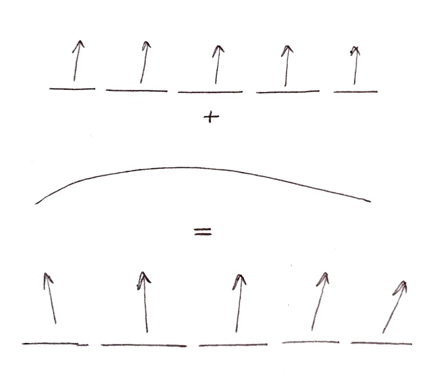

Theory
======

**TO BE UPDATED...**

* TODO: add some general references about VLM

Notes on geometry of twisted quadrilateral wing semgents
--------------------------------------------------------

This file documents the equations used in the geometry generation routine of the PyTORNADO program, currently in development at AIRINNOVA AB, Stockholm.

.. figure:: _static/images/geometry_quadrilateral_segments.png
   :scale: 100
   :alt: Geometry of twisted quadrilateral wing segments
   :align: center

   Geometry of twisted quadrilateral wing segments

Airfoil modelling
-----------------

   Principle of the airfoil modelling
