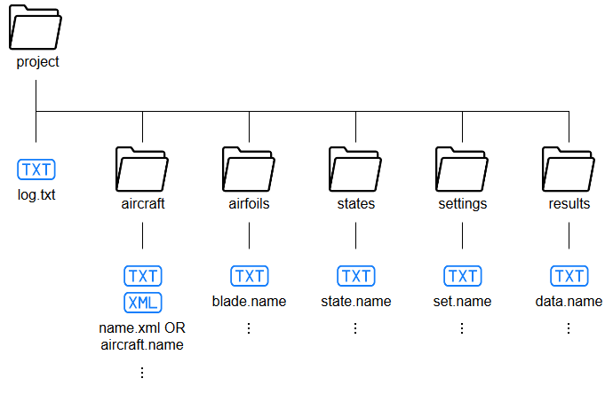

.. _detailed_user_guide:

Detailed User Guide
===================

**TO BE UPDATED...**

Working directory
-----------------

|name| expects the user's current working directory -- from which the program is executed -- to follow a certain structure, detailed in this section (see also figure). If missing, the folder structure is automatically generated.

   Expected structure of the user's *working* or *project* directory

The working directory, or project directory, is the path to the files related to the user's working project. The project directory is assumed to correspond to the location from which the program is executed.

At the root of the directory, the program keeps a log of runtime messages in a ``log.txt`` file.

aircraft/
~~~~~~~~~

The program searches for the aircraft definition files in a sub-folder named aircraft, expecting the following naming convention:

    * ``aircraft.name``
        * |name|'s native aircraft definition for aircraft with name ``name``
    * ``name.xml``
        * CPACS_ aircraft definition for aircraft with name ``name``

airfoil/
~~~~~~~~

The program requires the coordinates of the wing profiles at the inner and outer edges of each segment, to modify the panel normal vectors based on camber. This data is must lie in the airfoil directory, in files named as follows:

* ``blade.name``
    * coordinate file of airfoil name

state/
~~~~~~

The program searches for the definition of the flight state in a sub-folder named state, expecting the following naming convention:

* ``state.name``
    * flight state definition for state ``name``

settings/
~~~~~~~~~

The program searches for the settings file, or configuration file, in the settings sub-folder, expecting the following naming convention:

* ``set.name``
    * settings for case ``name``

results/
~~~~~~~~

.. warning::
    TODO: Structure to be defined.

Program execution
-----------------

The program must be executed from the user's project directory, using one of the following commands:

* ``path_to_pyTORNADO/pytornado.py``
* ``python path_to_pyTORNADO/pytornado.py``
* ``python -m path_to_pyTORNADO/pytornado``

Below, available command line arguments are listed:

.. include:: _help_page.txt
    :literal:

To run a VLM calculation based on a given configuration file ``set.NAME_SETTINGS``, the user must provide the extension ``NAME_SETTINGS`` using the argument ``--run``.

* ``--run NAME_SETTINGS``

The user may alternatively wish to call one of a number of utility functions, using the arguments:

    * ``--set_cpacs CPACS STATE`` write PyTORNADO state into CPACS file
    * ``--get_cpacs CPACS`` get PyTORNADO state and aircraft from CPACS file
    * ``--wkdir`` make PyTORNADO project directory template in-place

Optionally, the following mutually exclusive arguments are accepted:

    • ``-q`` or ``--quiet`` for QUIET mode (display error messages only)
    • ``-v`` or ``--verbose`` for VERBOSE mode (display more log messages than usual)
    • ``-d`` or ``--debug`` for DEBUG mode (display all log messages)

Execution procedure
-------------------

When the program is executed, the following steps are performed:

    #. data structures Aircraft, FlightState, Settings, VLMLattice, VLMData, are initialized.
    #. Settings data structure is populated with execution settings from ``set.*`` file.
    #. The aircraft model is loaded into Aircraft from the provided ``aircraft.*`` or ``*.xml`` file.
    #. The aircraft model input data is verified, then the aircraft geometry is generated.
    #. Optionally, the aircraft geometry is displayed.
    #. The flight state data is loaded into FlightState from the provided ``state.*`` file.
    #. The flight state input data is verified, and reference values are copied into FlightState.
    #. Optionally, the discretization settings are automatically generated.
    #. The aircraft lattice is generated, and stored in VLMLattice.
    #. Optionally, the aircraft lattice is displayed.
    #. The aircraft lattice is used to calculate downwash factors.
    #. Optionally, the matrix of downwash factors is displayed.
    #. The aircraft lattice and flight state are used to calculate the right-hand side term.
    #. Vortex strengths are calculated by solving the linear system using LAPACK's dgesv.
    #. Forces, velocities and coefficients are computed.
    #. Optionally, selected results are displayed.

A ``log.txt`` file is generated at each execution to aid in debugging.

.. toctree::
   :maxdepth: 2
   :caption: Input file formats

   input_file_formats.rst
