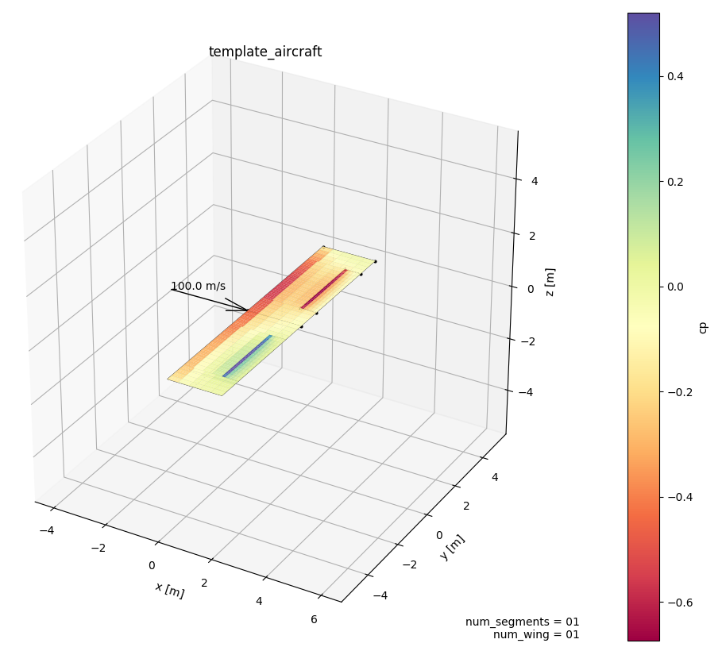

Getting started
===============

This page briefly explains how to get started with a very simple example using |name|'s command line interface. Notice that a more detailed user guide can be found here: :ref:`detailed_user_guide`

First, open a terminal and try to simply run the command ``pytornado`` (without any arguments). A brief help page should show up. One of the available arguments is ``--make-example`` which we will use in this tutorial to create a minimal working example.

.. code::

    pytornado --make-example

This command creates a folder named `pytornado` in your current directory. Change into this folder (``cd pytornado``) and then run

.. code::

    pytornado -v --run settings/template.json

The flag ``-v`` tells |name| to go into *verbose* mode. You should see some text output on your terminal screen. We use ``--run`` to execute a VLM analysis. The argument is the path to |name|'s main settings file. If everything worked correctly, you should see a plot of a simple rectangular wing.

While creating this minimalistic example, several directories and files were created. Feel free to explore the different files. However, don't be worried if you don't understand everything yet. We will give more detailed instructions on the following pages.
