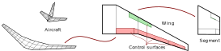

.. _input_file_aircraft:

Aircraft file
=============

An aircraft file defines the (undeformed) geometry of an aircraft. Aircraft models are defined using a hierarchical system. An **aircraft** is made up of one or more **wings**. Each wing may be divided into **segments** (a quadrilateral), and each wing may also have **control surfaces**.

    An *aircraft* is broken down into *wings* and a wing is broken down into *segments*. Each wing can have any number of *control surfaces*. (Note that *segment strips* and *strip subdivisions* are part of |name|'s internal API. However, they are not relevant for the model input discussed here.)

Coordinate system
-----------------

Note that all absolute coordinates in the aircraft file are based to the *body-fixed* coordinate system.

.. figure:: ../_static/images/conventions/body_fixed_coordinate_system.svg
   :width: 300 px
   :align: center
   :alt: Body fixed coordinate system

   Body fixed coordinate system

.. seealso::

    :ref:`coordinate_systems`

Example file
------------

The aircraft definition file closely resembles the this hierarchical structure discussed above. A fairly simple example is shown below.

.. include:: pytornado/aircraft/template_aircraft.json
    :code: json

Aircraft: uid (unique identifier)
---------------------------------

The ``uid`` keyword defines the *name* of the aircraft. You may choose any string here. The name will for instance be shown as titles on plots.

Aircraft: refs (reference values for aerodynamic coefficients)
--------------------------------------------------------------

Aerodynamic coefficients like drag or lift coefficients only have a meaning if the corresponding reference value are known. In |name|, reference values have to explicitly defined. There are five reference values in |name|:

* ``area`` Wing surface area in [:math:`m^2`]
* ``span`` Wing span in [:math:`m`]
* ``chord`` Wing mean aerodynamic chord in [:math:`m`]
* ``gcenter`` Centre of gravity in form [:math:`X`, :math:`Y`, :math:`Z`] where :math:`X`, :math:`Y`, :math:`Z` are coordinates [:math:`m`]
* ``rcenter`` Centre of rotation in form [:math:`X`, :math:`Y`, :math:`Z`] where :math:`X`, :math:`Y`, :math:`Z` are coordinates [:math:`m`]

How these reference values are used is described in section :ref:`coeffs`.

Aircraft: wings (wing object)
-----------------------------

The ``wings`` keyword is followed by a list (square bracket). Each list entry must be a description of a separate wing. The ``wings`` list must contain at least one wing.

*Structure of the wing list*

.. code:: json

    "wings": [
        {
            << description of wing object 1 >>
        },
        {
            << description of wing object 2 >>
        }
    ]

Wing: uid (unique identifier)
~~~~~~~~~~~~~~~~~~~~~~~~~~~~~

Each wing must have a UID (|uid|).

Wing: symmetry (symmetry flag)
~~~~~~~~~~~~~~~~~~~~~~~~~~~~~~

Aircraft normally have a symmetry plane, i.e. the wing on one side can have a mirror image on the other side. *Wings* can have *symmetry* flags. If such a flag is set, the *mirror* image will be generated and included in the VLM analysis. Symmetries can be defined across the three basic planes in the |ccs|.

=====  =================================
Flag   Description
=====  =================================
0      No symmetry
1      Symmetry across :math:`X\text{-}Y` plane
2      Symmetry across :math:`X\text{-}Z` plane
3      Symmetry across :math:`Y\text{-}Z` plane
=====  =================================

In most cases the symmetry flag *2* is used. In a conventional configuration both the main wing and the horizontal tail can/should have this flag. The vertical stabiliser does not have any mirror, hence the symmetry flag is *0*.

Wing: segments (symmetry objects)
~~~~~~~~~~~~~~~~~~~~~~~~~~~~~~~~~

The ``segments`` keyword is followed by a list (square bracket). Each list entry must be a description of a separate wing segment. The ``segments`` list must contain at least one segment.

*Structure of the segment list*

.. code:: json

    "segments": [
        {
            << description of wing segment object 1 >>
        },
        {
            << description of wing segment object 2 >>
        }
    ]

Segments: uid (unique identifier)
^^^^^^^^^^^^^^^^^^^^^^^^^^^^^^^^^

Each segment must have a UID (|uid|).

Segments: vertices
^^^^^^^^^^^^^^^^^^

Segments can be defined in two ways, either using the *vertices* field or using the *geometry* field. The vertex based description is quite straight-forward. Each wing segment is a quadrilateral_, i.e. basically a plane in 3D space which is defined by four vertices. The vertices are named :math:`a`, :math:`b`, :math:`c` and :math:`d`. Each vertex is a point in 3D space given by the list with the coordinates [:math:`X`, :math:`Y`, :math:`Z`]. A segment is fully defined as shown in the following example:

.. code:: json

    "vertices": {
        "a": [0, 0, 0],
        "b": [0, 5, 0],
        "c": [2, 5, 0],
        "d": [2, 0, 0]
    }

**TODO** add illustration

Segments: geometry
^^^^^^^^^^^^^^^^^^

**TODO** add illustration

Segments: airfoils
^^^^^^^^^^^^^^^^^^

A segment can have an *inner* and an *outer* airfoil. The inner airfoil is located at the segment edge :math:`a`-:math:`d`, and the outer airfoil is located along edge :math:`b`-:math:`c`. In between the inner and outer airfoil the airoil geometry will vary linearly as illustrated with the following animation.

**TODO** add animation

There are two ways to define airfoils. First, NACA_ airfoils (4-digit series) can be defined with a string ``"NACAxxxx"`` where ``xxxx`` are the digits. Second, arbitrary airfoils can be included from separate file. The airfoil file should be located in the **airfoils** folder of the project directory. An absolute or relative file path to the airfoil file which is to be loaded must be included. Preferably, a relative path is used (relative to the project directory, e.g. ``"airfoils/file_with_airfoil_coordinates.dat"``).

*Example airfoil definitions*

.. code:: json

    "airfoils": {
        "inner": "NACA2412",
        "outer": "airfoils/file_with_airfoil_coordinates.dat"
    },

.. seealso::

    More information on airfoils can be found here: :ref:`input_file_airfoils`

**TODO** add illustration

Segments: panels
^^^^^^^^^^^^^^^^

The number of panels can be set manually for a specific segment. ``num_s`` is the number of *spanwise* panels and ``num_c`` is the number of *chordwise* panels.

.. code:: json

    "panels": {
        "num_s": 10,
        "num_c": 5
    }

.. hint::

    This is an optional setting. |name| will try to find a good number of panels for each segment. The ``panels`` setting may be ommitted.

Wing: controls
~~~~~~~~~~~~~~

Besides ``segments`` (at least one required), wings can optionally have *control surfaces* which are defined using the keyword ``controls``. The ``controls`` keyword is followed by a list (square bracket). Each list entry must be a description of a separate control surface.

*Structure of the contol surface list*

.. code:: json

    "controls": [
        {
            << description of wing control object 1 >>
        },
        {
            << description of wing control object 2 >>
        }
    ]

Control: uid (unique identifier)
^^^^^^^^^^^^^^^^^^^^^^^^^^^^^^^^

Each control must have a UID (|uid|).

Control: device_type
^^^^^^^^^^^^^^^^^^^^

Control surfaces can be leading edge devices or trailing edge devices. The keyword ``device_type`` must be followed by one of the following two strings:

* ``"flap"`` Trailing edge device
* ``"slat"`` Leading edge device

**TODO** add illustration

Control: deflection
^^^^^^^^^^^^^^^^^^^

Control surface deflection in degrees [:math:`^\circ`] on the wing main side.

**TODO** sign convention

**TODO** add illustration

Control: deflection_mirror
^^^^^^^^^^^^^^^^^^^^^^^^^^

Control surface deflection in degrees [:math:`^\circ`] on the mirrored side. This setting is only applicable if the wing has a mirrored side. Otherwise this setting will be ignored.

Control: segment_uid
^^^^^^^^^^^^^^^^^^^^

Control surfaces may span across multiple wing segments. The keyword ``segment_uid`` defines where the inner and the outer edge of the control segment are located. For instance, to let a control surface span from a segment called ``uid_of_the_INNER_segment`` to another segment with UID ``uid_of_the_OUTER_segment``, you can write:

.. code:: json

    "segment_uid": {
        "inner": "uid_of_the_INNER_segment",
        "outer": "uid_of_the_OUTER_segment"
    },

Of course, the segment with UID ``uid_of_the_INNER_segment`` and the segment with UID ``uid_of_the_OUTER_segment`` must exist and they must be located on the same wing.

**TODO** add illustration

Control: rel_vertices
^^^^^^^^^^^^^^^^^^^^^

* Relative vertices for each segment

**TODO**

Control: rel_hinge_vertices
^^^^^^^^^^^^^^^^^^^^^^^^^^^

* Relative vertices for each segment

**TODO**

Control: panels
^^^^^^^^^^^^^^^

The ``panels`` setting for control surfaces is an optional setting which can be used to manually set the number of panels for a specific control surface. Notice that only the number of *chordwise* panels can be set for a control surface. The number of spanwise panels is determined by the segment on which the control is placed.

.. code:: json

    "panels": {
        "num_c": 5
    }
